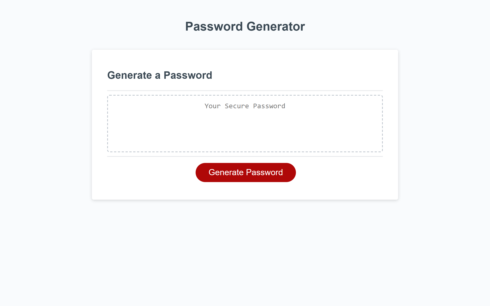

# Password Generator

Welcome to the Password Generator project! This simple web application allows users to generate random passwords based on their preferences.

## Table of Contents
- [Features](#features)
- [How to Use](#how-to-use)
- [Installation](#installation)
- [License](#license)
- [Preview](#preview)

## Features

- Password length customization (between 8 and 128 characters).
- Options to include lowercase, uppercase, numbers, and special characters.
- Validation to ensure at least one character type is selected.
- Optional validation to ensure the password contains at least one character from each selected type.

## How to Use

1. Open the [Password Generator](#) in your web browser.
2. Click the "Generate Password" button.
3. Follow the prompts to customize your password preferences.
4. Click "OK" or "Cancel" for yes or no questions.
5. View your generated password in the provided text area.

## Installation

No installation is required. Simply open the [Password Generator](#) link in your web browser.

## License

This project is licensed under the [MIT License](LICENSE).

## Preview

Below is a preview of the deployed site. Thank you for taking the time to check out my project!

